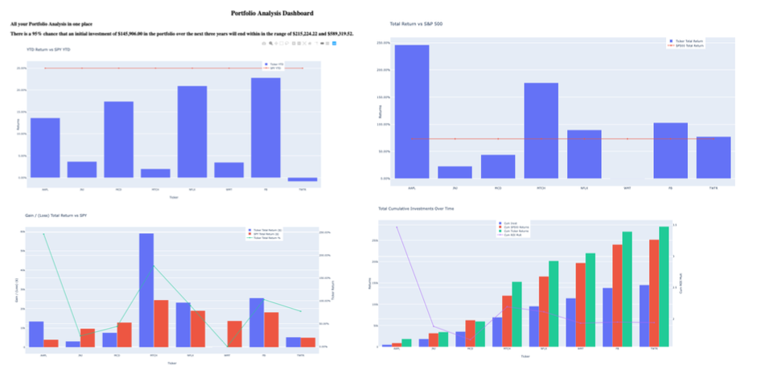
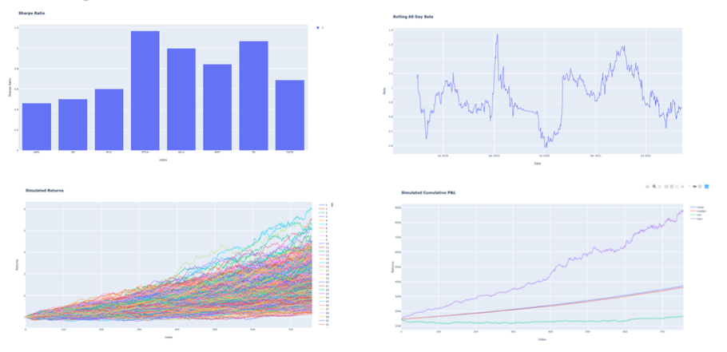

## Portfolio Analysis
This project contains a financial database and web application by using API, SQL, Python, and the Dash library to analyze and display the performance of a stock/bond portfolio in a Dash dashboard as a web based application. The performance of a hypothetical stock and bond portfolio is tracked using several key data calculations. This Quantatitive Analysis (QA) was completed using Panda DataFrames to display several key metrics of the portfolios performance. Among the QA is YTD Return vs SPY YTD, Total Return vs SP500, P&L Total Return SPY, Total Cumalative Return over time, Daily Returns, Cumulative Return by Ticker, Rolling 21 day return, Sharpe Ratio, Rolling 60 day Beta, Simulated Returns, Simulated Cumulative P&L.


## Dashboard Images




- - - 
## Technologies

This is a Python v 3.7 project leveraging numerous python modules. The modules are to be imported to the main project file.

#### -- Modules
Modules to be imported to a editor. This project primarily uses Jupyter Notebook while the presentation layer uses Dash for the interactive visual dashboard.
```
# Import initial libraries
import os
import pandas as pd
import numpy as np
import datetime
import matplotlib.pyplot as plt
%matplotlib inline
import alpaca_trade_api as tradeapi
import dash
import dash_core_components as dcc
import dash_html_components as html
import plotly.express as px
import plotly.graph_objects as go
from plotly.subplots import make_subplots
from MCForecastTools import MCSimulation
from plotly.offline import download_plotlyjs, init_notebook_mode, plot, iplot

import plotly.graph_objs as go
import plotly.offline as pyo
import plotly.graph_objs as go
# Set notebook mode to work in offline
pyo.init_notebook_mode(connected=True)
```

#### -- APIs and Datasources
Alpaca SDK was used to create the Alpaca tradeapi.REST object to get the source data. Reqister for an account with Alpaca to receive a Secret Key and API Key.

Click this [link](https://app.alpaca.markets/login) to register and receive your keys. For security save the keys in an environment file independently outside of the main project file. 

#### -- Connection String to Database
Database Connection String
Database connection string and the physical database to consolidate and query the datasources.

```
database_connection_string ='sqlite:///Muskies.db'
```
The project also reads historical ticker prices from an excel workbook

- - - 
## Installation Guide
The project requires the following environments to be installed in the main project file via a command line system:

```
conda create -n project python=3.7 anaconda -y
conda activate project
conda install -c pyviz hvplot geoviews
pip install python-dotenv
pip install alpaca-trade-api
conda install -c anaconda requests
conda install ipykernel
conda install nb_conda_kernels
conda install dash
conda install -c plotly jupyter-dash
conda install -c plotly jupyterlab-dash
```

As a resource, the following link is to the Python 3.7 Reference Guide 

[Python documentation](https://docs.python.org/3.7/)


- - - 
## Contributors
This is a group student project for Columbia University FinTech bootcamp.

- - - 
## License
Any usage of this project should be authorized from Columbia Univesity bookcamp.

